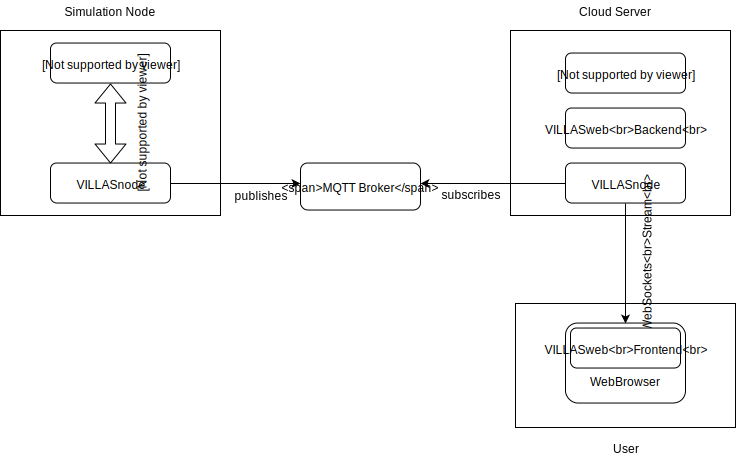

# Guide {#guide}

## Architecture

**TODO:** Describe role of components in a few sentences.

## Installation Steps

---- On Simulation Node -----

1. Install your favourite Simulation Tool
  - [DPsim](https://git.rwth-aachen.de/acs/public/simulation/dpsim), OPAL-RT, RTDS, ...
2. Install VILLASnode as Gateway for Simulation Data
3. Configure VILLASnode to relay data between Simulator and MQTT Broker

---- On Cloud Server -----

1. Install VILLASweb for Visualization / Control / Management
   - Use the [Demo Repo](https://git.rwth-aachen.de/acs/public/villas/Demo) includes for a Docker setup including:
     - VILLASnode
     - VILLASweb
     - MongoDB as Database
     - RabbitMQ as MQTT Broker

2. Configure VILLASodne to relay data between MQTT Broker and Web Interface

4. Create Users
5. Create Simulator
6. Create Simulation
7. Create Simulation Model
8. Create Project
9. Create Visualization