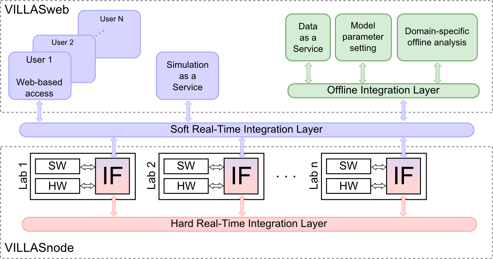

# VILLAS - **V**irtually **I**nterconnected **L**aboratories for **LA**rge systems **S**imulation/emulation

## High-level VILLAS Architecture

Design objective for VILLAS framework: a holistic framework with modular and generic architecture

Three integration layers are foreseen based on the diversity of the facilities and applications:
- Hard Real-Time Integration Layer (H-RTIL)
- Soft Real-Time Integration Layer (S-RTIL)
- Offline Integration Layer (O-IL)

**_Hard Real-Time Integration Layer (H-RTIL)_**
- Integrates digital real-time simulators, actual hardware devices and test benches into a joint experiment
- H-RTIL requires interfaces that provide deterministic and synchronized data exchange between laboratories
- Real-time protocols and physical point-to-point connections should be used

**_Soft Real-Time Integration Layer (S-RTIL)_**
- Integration of tools and applications with less critical timing requirements (inaccurate timing or time-varying delays are acceptable to some extent)
- User interaction via web-based access
- High-level tools, system level control, optimization applications

**_Offline Integration Layer (O-IL)_**
- Integration of domain-specific analyses that are performed at pre-experiment and post-experiment phases
- An interface to adapt parameters or models of experiments in a pre-experiment phase
- Non-real-time tasks during the experiment, such as data logging for Data as a Service
